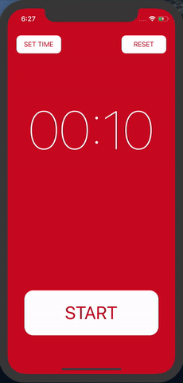

## ReactNative과 Redux를 이용해 만든 타이머

#### Soonchunhyang University<br/>
#### Department of Computer Software Engineering

---

#### [김민수](https://github.com/alstn2468)

#### [ [Facebook](https://www.facebook.com/profile.php?id=100003769223078) ] [ [Github](https://github.com/alstn2468) ] [ [LinkedIn](https://www.linkedin.com/in/minsu-kim-336289160/) ] [ [Blog](https://alstn2468.github.io/) ]<br/>

### To Do

- [x] 타이머 컴포넌트 구성
- [x] 버튼 컴포넌트 구성
- [x] 액션 타입 정의
- [x] Action Creators 정의
- [x] Reducer 정의
- [x] Reducer Function 정의
- [x] `store`생성 및 `Provider` 연결
- [x] 타이머 컴포넌트 Container-Presenter패턴으로 분리
- [x] `store`와 타이머 컴포넌트 연결
- [x] Action Creators와 타이머 컴포넌트 연결
- [x] `setInterval` 사용 및 중지로 타이머 시간 제어
- [x] 타이머 컴포넌트에 시간 출력
- [x] 타이머 초기화 기능 구현
- [ ] 타이머 시간 지정 기능 구현

### DEMO



### Dependency
- expo
- prop-types
- react-native
- react-redux
- redux

### Actions

- `START_TIMER` : 타이머를 시작
- `PAUSE_TIMER` : 타이머를 중지
- `RESET_TIMER` : 타이머를 초기화
- `ADD_SECOND` : 타이머 시간 증가

### Action Creators

각각의 `action type`을 반환

- `startTimer` : `START_TIMER`액션 반환
- `pauseTimer` : `PAUSE_TIMER`액션 반환
- `resetTimer` : `RESET_TIMER`액션 반환
- `addSecond` : `ADD_SECOND`액션 반환

### Reducer

`TIME_DURATION` : 타이머 시간 상수<br>

- 초기 상태


`reducer`함수 정의할 때 `state = initialState`로 초기 상태 설정<br>

```javascript
const initialState = {
    isPlaying: false,
    elapsedTime: 0,
    timerDuration: TIMER_DURATION
};
```

`reducer`함수를 정의해 `state`와 `action`을 받아<br>
`action.type`에 맞는 **Reducer Function** 호출<br>

### Reducer Function

- `applyStartTimer` : 타이머 시작 **Reducer Function**

이전의 `state`를 저장하고 `isPlaying`을 `true`로 변경<br>

- `applyPauseTimer` : 타이머 중지 **Reducer Function**

이전의 `state`를 저장하고 `isPlaying`을 `false`로 변경<br>

- `applyResetTimer` : 타이머 초기화 **Reducer Function**

`state`를 `initialState`로 초기화<br>

- `applyAddSecond` : 타이머 시간 증가 **Reducer Function**

시간이 남았을 경우 이전 `state`저장 및 `elapsedTime` 1증가<br>
시간이 남지 않았을 경우 `initialState`로 초기 상태로 변경<br>